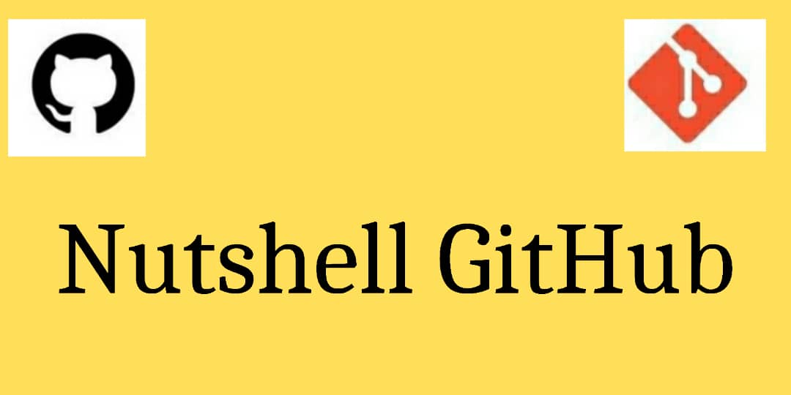

> The journey of a thousand miles begins with a single step.

## Introduction

GitHub is a huge resource for developers, it houses most of the code used for software development. But unfortunately, a lot of developers don't know how to use Git or GitHub especially beginners and they are unable to contribute to open source due of this gap in their knowledge.

This project was built to provide resources for developers to find all they need to understand Git and GitHub.

## Quick Links

* [Git/GitHub Courses/Videos](#gitgithub-coursesvideos) - Courses or videos that clarify what Git or GitHub is about and how to utilize them.
* [Git/GitHub Repositories](#gitgithub-repositories) - Instructions on how to use Git or GitHub can be found in these repositories.
* [Git/GitHub Articles](#gitgithub-articles) - The basics and fundamentals of Git and GitHub are explained in these articles.
* [Git/GitHub Books](#gitgithub-books) - Books to help you learn how to utilize GitHub and master the Git version control system.

# Git/GitHub Courses/Videos

- [Introduction to Git and GitHub - Offered By Google](https://www.coursera.org/learn/introduction-git-github?specialization=google-it-automation&utm_source=gg&utm_medium=sem&utm_campaign=11-GoogleITwithPython-ROW&utm_content=11-GoogleITwithPython-ROW&campaignid=9733806670&adgroupid=119184274733&device=c&keyword=&matchtype=b&network=g&devicemodel=&adpostion=&creativeid=507191775308&hide_mobile_promo&gclid=CjwKCAjwxo6IBhBKEiwAXSYBs8cqMR-9WYlilq7CrcFTkE7wQT1K7qv1XDpTa5HtjEJckeoyiU6cpRoCyCgQAvD_BwE)
- [Git & GitHub Crash Course For Beginners - Traversy Media](https://www.youtube.com/watch?v=SWYqp7iY_Tc)
- [Version Control with Git](https://www.udacity.com/course/version-control-with-git--ud123)
- [Git and GitHub Crash Course By Google Coursera](https://www.youtube.com/watch?v=PtBr0fpKyFg)
- [Version Control with Git](https://www.coursera.org/learn/version-control-with-git)
- [Git In Depth](https://frontendmasters.com/courses/git-in-depth/)
- [Git Tutorial for Beginners](https://www.youtube.com/watch?v=XF99kTmS2gg)
- [GitHub Basics Tutorial - How to Use GitHub](https://www.youtube.com/watch?v=x0EYpi38Yp4)
- [Git for Developers Using Github](https://www.coursera.org/projects/git-for-developers-using-github)
- [Git Tutorial for Beginners - The Basics](https://www.youtube.com/watch?v=ly4niPr9vUo)
- [Git: Become an Expert in Git & GitHub in 4 Hours](https://www.udemy.com/course/git-expert-4-hours/)
- [Introduction to GitHub- The GitHub Training Team](https://lab.github.com/githubtraining/introduction-to-github)
- [Git and GitHub for Beginners - Crash Course](https://www.youtube.com/watch?v=RGOj5yH7evk&t=934s)
- [Git and GitHub Tutorial - Edureka](https://www.youtube.com/watch?v=PQsJR8ci3J0)
- [Introduction to Git and GitHub](https://www.classcentral.com/course/introduction-git-github-18060) 
- [Manage Your Versions with Git (Part I)](https://www.coursera.org/projects/git-1)
- [Manage Your Versions with Git (Part II)](https://www.coursera.org/projects/git-2)
- [Learn Gitpro-logo- Codecademy](https://www.codecademy.com/learn/learn-git)
- [Git And GitHub in ~ 30 Minutes](https://www.youtube.com/watch?v=jG4Vs81kMlc)
- [Git & Github Tutorial for Absolute Beginners](https://www.youtube.com/watch?v=iCKAWxfVWUY)
- [Git Tutorial For Beginners - Kudvenkat](https://www.youtube.com/watch?v=WEmvT2YFlQw&list=PL6n9fhu94yhVwbuqXKuPzchWNjZ8GVcJa)
- [Git Tutorial for Beginners - Git & GitHub Fundamentals In Depth](https://www.youtube.com/watch?v=DVRQoVRzMIY)
- [Git & GitHub Tutorials](https://www.youtube.com/watch?v=_bkT85B6n1U&list=PLzS3AYzXBoj8mX3WbzQDghYytnx2JqBrU)
- [Git Essentials: Mini Course](https://www.udemy.com/course/git-essentials-mini-course/)
- [How Git Works - Plurasight](https://www.pluralsight.com/courses/how-git-works)
- [Git Tutorial for Beginners: Command-Line Fundamentals](https://www.youtube.com/watch?v=HVsySz-h9r4)
- [Git And GitHub Full Course In 3 Hours - Git And GitHub Tutorial For Beginners ](https://www.youtube.com/watch?v=liwv7Hi68aI)
- [Git-GitHub Tutorial for Beginners](https://www.youtube.com/watch?v=dnGeRjP8oxw)
- [Git Tutorial For Dummies](https://www.youtube.com/watch?v=mJ-qvsxPHpY)
- [Git and GitHub Beginner Tutorials](https://www.youtube.com/watch?v=-U-eUHI6euM&list=PLhW3qG5bs-L8OlICbNX9u4MZ3rAt5c5GG)
- [Git and GitHub Tutorials](https://www.youtube.com/watch?v=r50BKIFGCI0&list=PLB5jA40tNf3v1wdyYfxQXgdjPgQvP7Xzg)
- [Git & GitHub Tutorial for Beginners](https://www.youtube.com/watch?v=3RjQznt-8kE&list=PL4cUxeGkcC9goXbgTDQ0n_4TBzOO0ocPR)
- [Github Tutorial For Beginners - Github Basics for Mac or Windows & Source Control Basics](https://www.youtube.com/watch?v=0fKg7e37bQE)
- [Git and GitHub Tutorial For Beginners | Full Course](https://www.youtube.com/watch?v=3fUbBnN_H2c)
- [Git Tutorial for Beginners: Learn Git in 1 Hour](https://www.youtube.com/watch?v=8JJ101D3knE)
- [Git Tutorial - Telusko](https://www.youtube.com/watch?v=OdbBmvfThJY&list=PLsyeobzWxl7q2eaUkorLZExfd7qko9sZC)

# Git/GitHub Repositories

- [GitHub Actions Starter Pack](https://github.com/jasonbarry/github-actions-starter-pack) - Sample code project for automating various tasks via GitHub Actions.
- [Online Git Reference](https://github.com/git/git-reference) - Quick reference guide of basic Git commands along with examples of common uses and options.
- [Git Commands](https://github.com/joshnh/Git-Commands) - A list of commonly used Git commands.
- [GitHub Cheat Sheet](https://github.com/tiimgreen/github-cheat-sheet) - A list of cool features of Git and GitHub.
- [Git - The Simple Guide](https://github.com/rogerdudler/git-guide) - Just a simple guide for getting started with git.
- [Git-it (Desktop App)](https://github.com/jlord/git-it-electron) - Git-it is a (Mac, Win, Linux) Desktop App for Learning Git and GitHub.